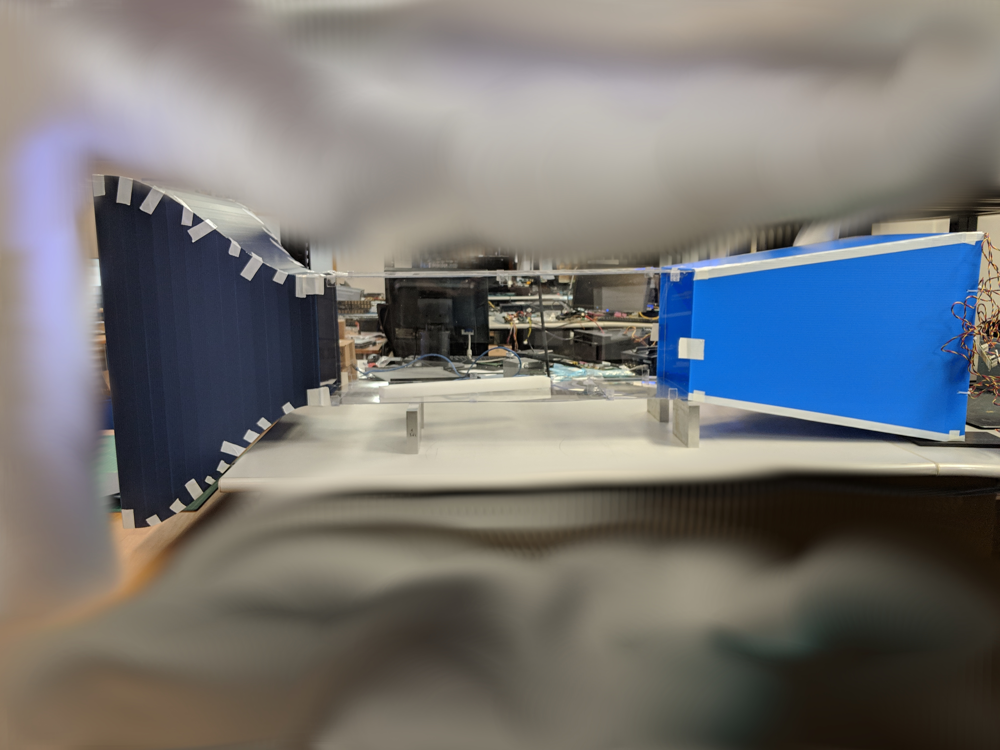
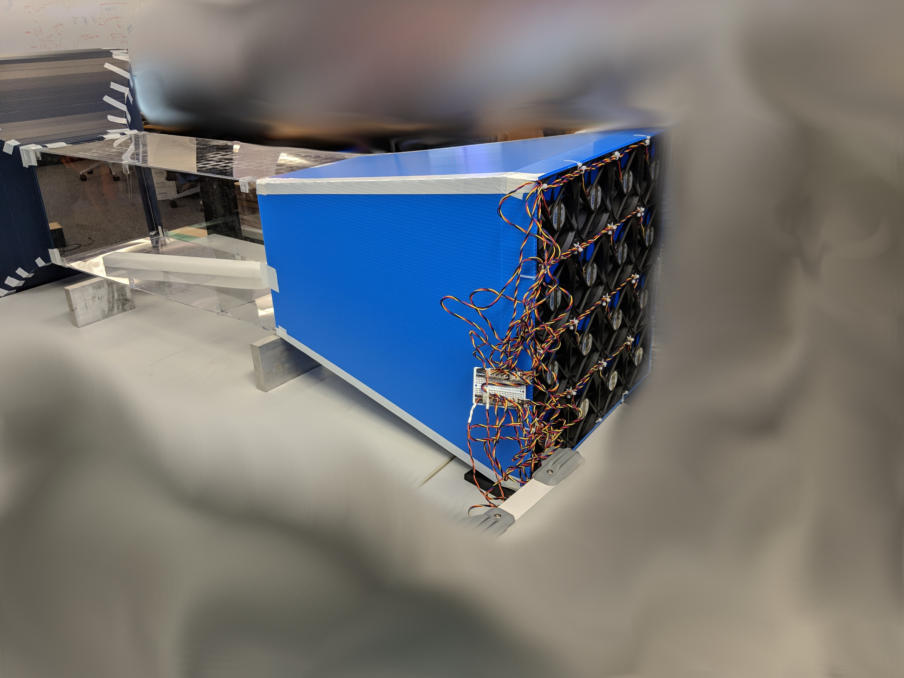
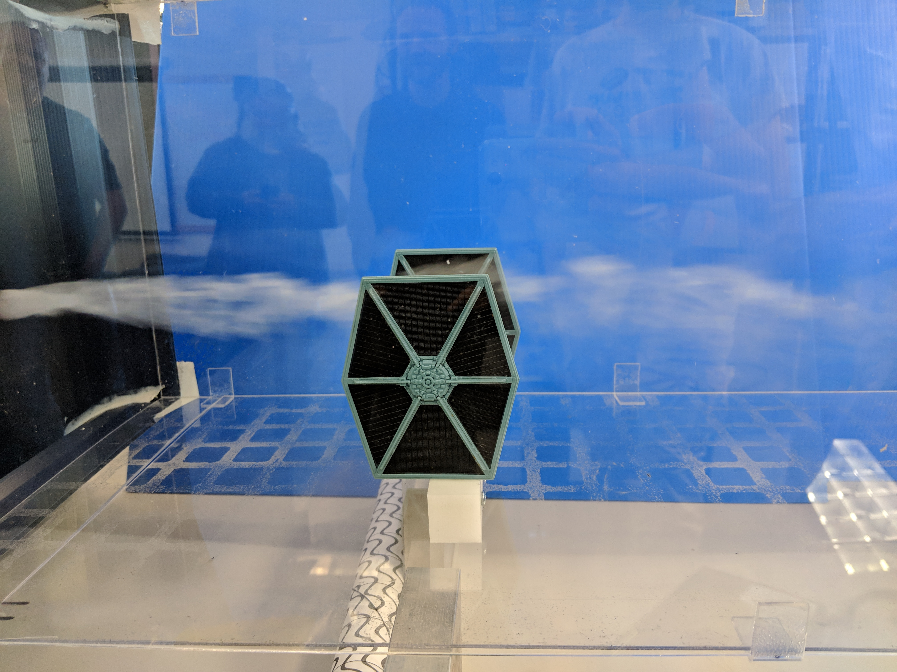

# wind_tunnel

Low speed wind tunnel made from scrap material and 12V DC computer fans capable of 0 to 1200 ft/min.

Calibration process is documented [here](pitot%20static%20tube%20calibration%20process/Thermal%20Load%20Card%20Pitot%20Static%20Tube%20Calibration.pdf)

